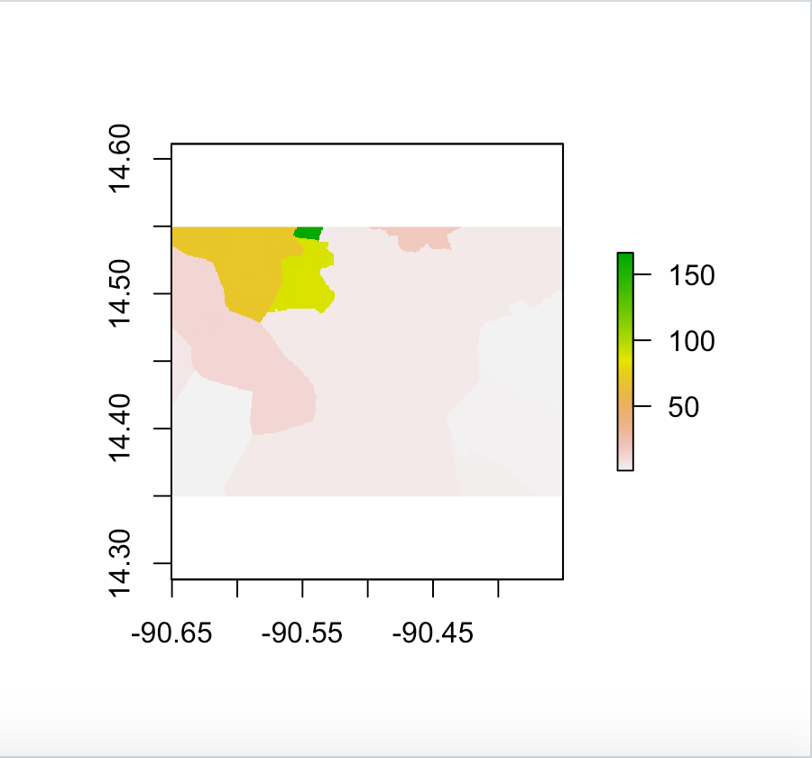
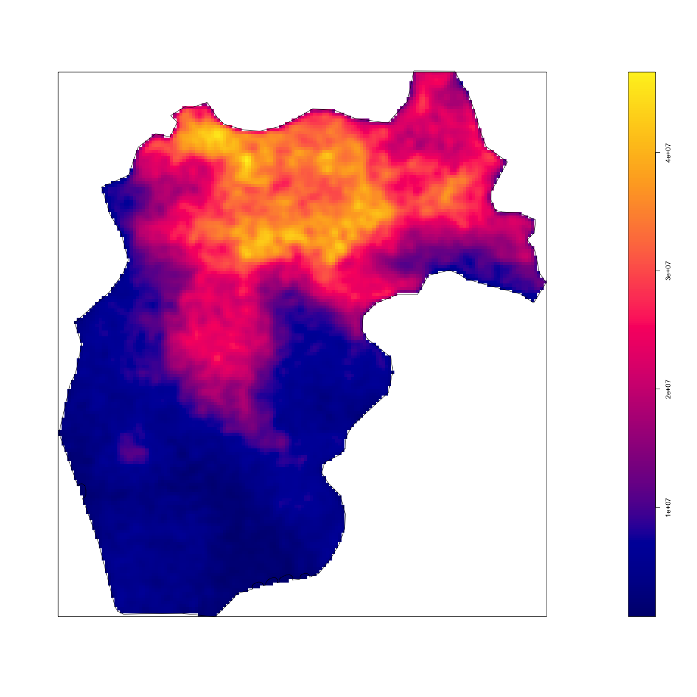

# Guatemala

## Administrative Subdivisions of Liberia

The image below shows the population and density distributions. The density bar graph shows that the population of the city of Guatemala is significantly higher than other cities.

Guatemala is divided into 22 Departamentos which are equivalent to states in the United States. The biggest Departamento is Guatemala, followed by Huehuetenango and Alta Verapaz who have half the population of the Departamento of Guatemala. The Departamento of Guatemala has Guatemala City which is a major city in the entire country, similar to the New York City and New York effect.

## Population of Guatemala's Counties 

The plot shown above is a representation of the error of the predicted values from the worldpop raster data on the city of Guatemala which is the most populated city in Guatemala. The northeast region shows regions of large under estimation in the northeast, northwest, and south region of Guatemala city. Throughout the surrounding areas there is consistent overestimation. 

This plot represents the population values from the worldpop database for the city of Guatemala. 

The Departamento I chose was Quetzaltenango where the majority of the population resides in the urban segment. 

The plot shown above reprsents the population density. It indicates that the majority of the population resides in the north of Quetzaltenango. There is only one urban region in this subdivision.

## Guatemala's Districts with Topography, Urban Areas, Road Networks, and Healthcare Facilities

In this segment I further analyzed Colomba, a district in the aforementioned Quetzaltenango Departamento. 
Colomb has a lower population along with the rest of the districts as Quetzaltenango is mostly mountains. I thought the road network and healthcare facilities would be best represented overlayed on the entire Departamento as the states population allows that. 

Below is the urban areas, road networks, and healthcare facilities of the Colomba district which has the population of around 30000 people. 

Below is the urban areas, road networks, and healthcare facilities of the Colomba district on the topography. This picture is an example of how healthcare facilities, road networks, and the population prefer a flatter settlement location. The graph indicates that the majority of the population resides on the flatter ground and that the only healthcare facility is located on the closer to the end of the flatter side.  

