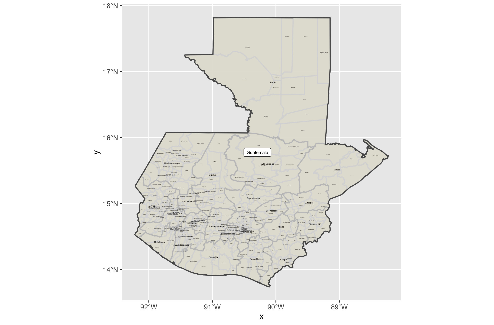
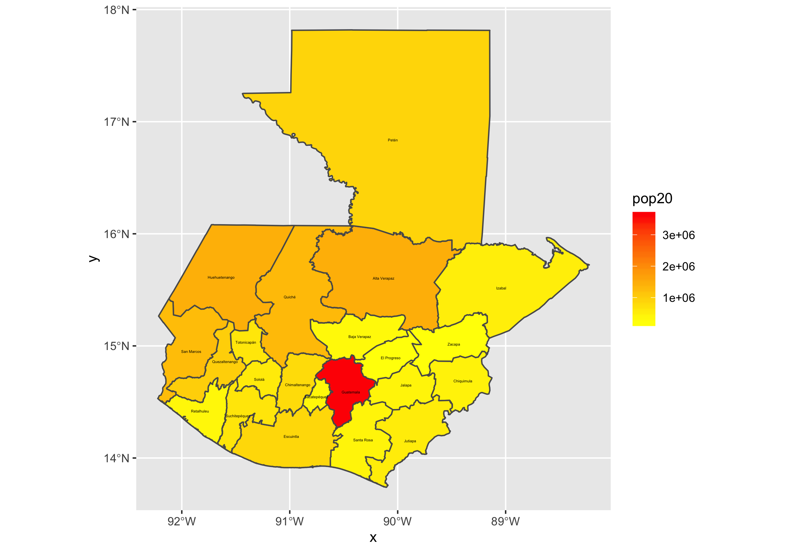
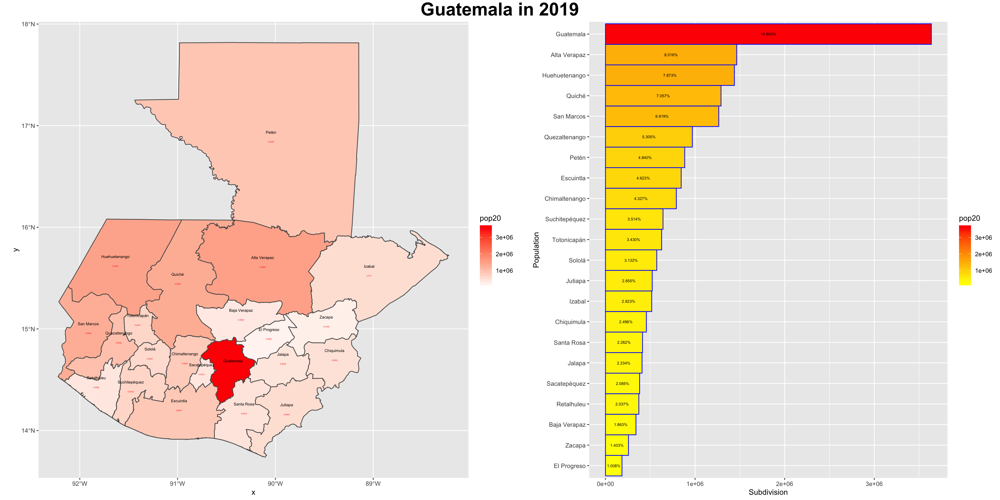

# Project 1 

## Projecting, Plotting, and Labeling Administrative Subdivisions

The main challenges I incurred with this project were simply with the aesthetics of the plot as since most of the subdivisions are in one area it was difficult to find a proper scale for the labels.  

## Extracting Populations from a Raster and Aggregating to each Unit

The primary challenge I faced was importing the package from GitHub for the third stretch goal. From this population plot of Guatemala we can infer that a large part portion of the population is in the city of Guatemala. The red contrasting with the yellow and orange makes it easy to identify. 

## Creating a Geometric Bar Plot with your Simple Feature object

The image below shows the population and density distributions. The density bar graph shows that the population of the city of Guatemala is significantly higher than other cities.

