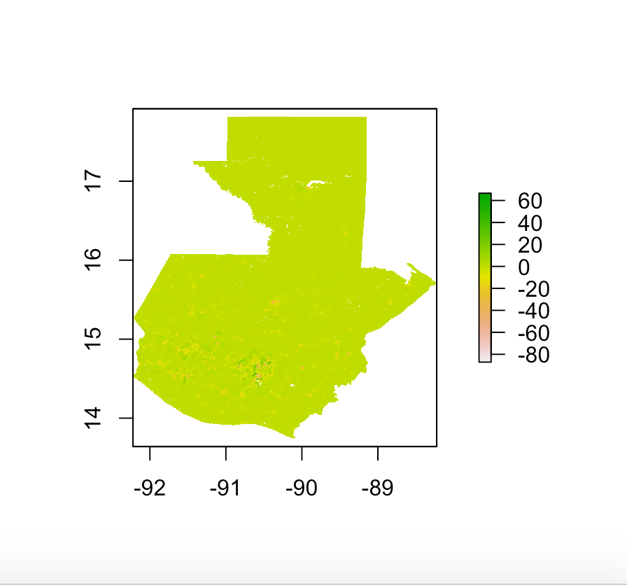
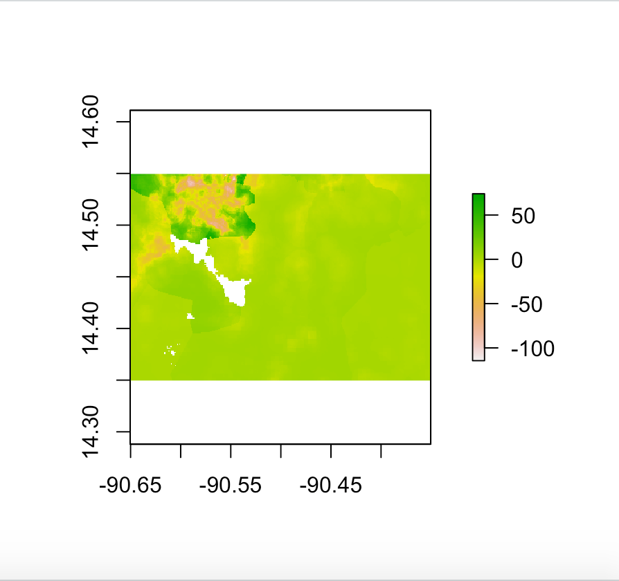
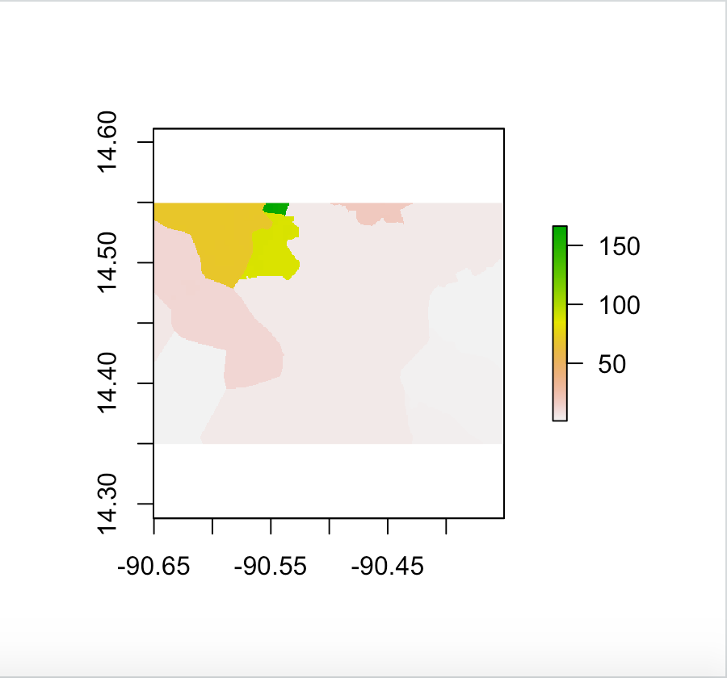
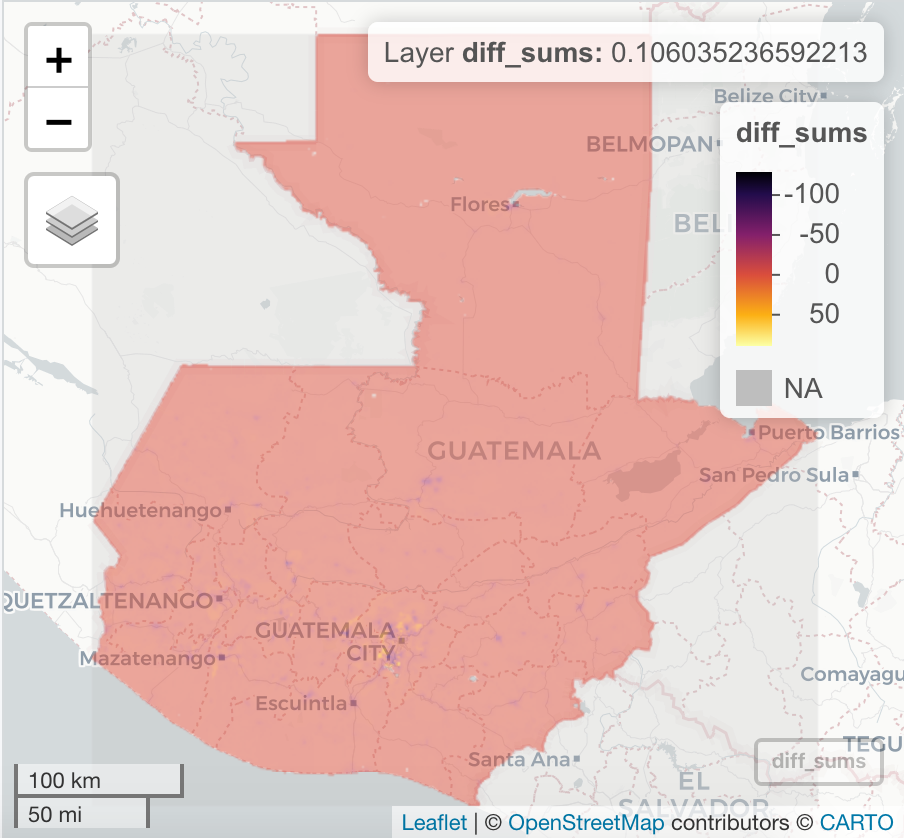

# Project 2

## Histogram of Population Distribution

The plot shown above is a representation of the population distribution accross Guatemala's adm2 subdivisions. 

## Density plot

The plot shown above is based on the log population data of Guatemala's adm2 subdivisions. 

## Residual model of night time lights with population distribution

The plot shown above is a residual model with a confidence interval and regression line that represents how night time lights, bare cover, and land cover are correlated with Guatemala's population distribution. 

### R-squared: 0.5302
### p-value: < 2.2e-16

The plot above shows the error of the predicted values from the worldpop raster data on Guatemala. The plot indicates that throughout the country there is a slight overestimation, however in the city of Guatemala there is a large underestimation. This is mainly due to the fact that the city of Guatemala is a more densely populated region compared to the rest of the country. 

The plot shown above is a representation of the error of the predicted values from the worldpop raster data on the city of Guatemala which is the most populated city in Guatemala. The northeast region shows regions of large under estimation in the northeast, northwest, and south region of Guatemala city. Throughout the surrounding areas there is consistent overestimation. 

This plot represents the population values from the worldpop database for the city of Guatemala. 

The plot above shows the error of the predicted values from the worldpop raster data on Guatemala overlayed with mapview. The plot indicates that throughout the country there is a slight overestimation, however in the city of Guatemala there is a large underestimation. This is mainly due to the fact that the city of Guatemala is a more densely populated region compared to the rest of the country. 
