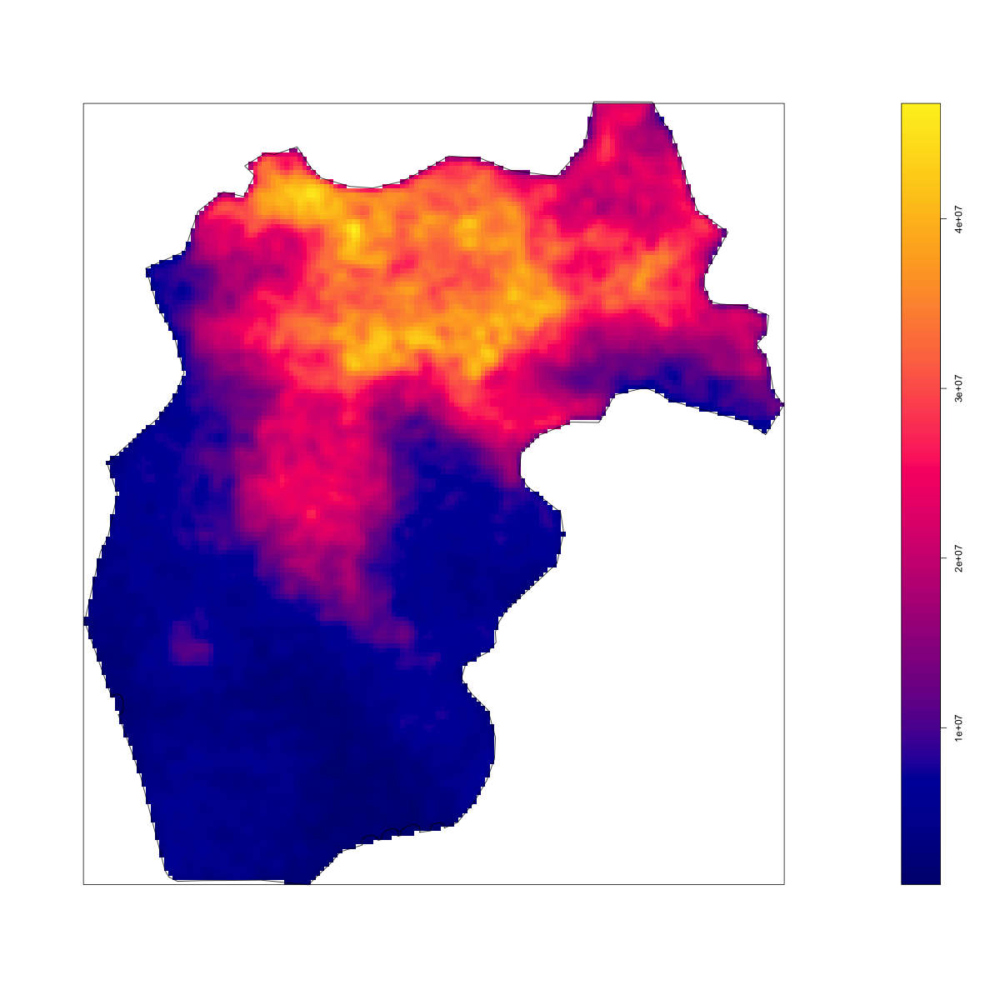
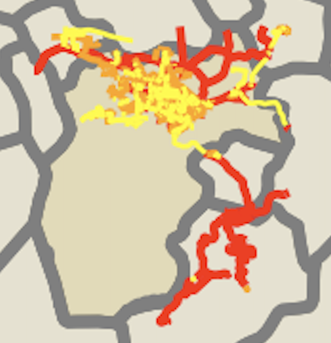
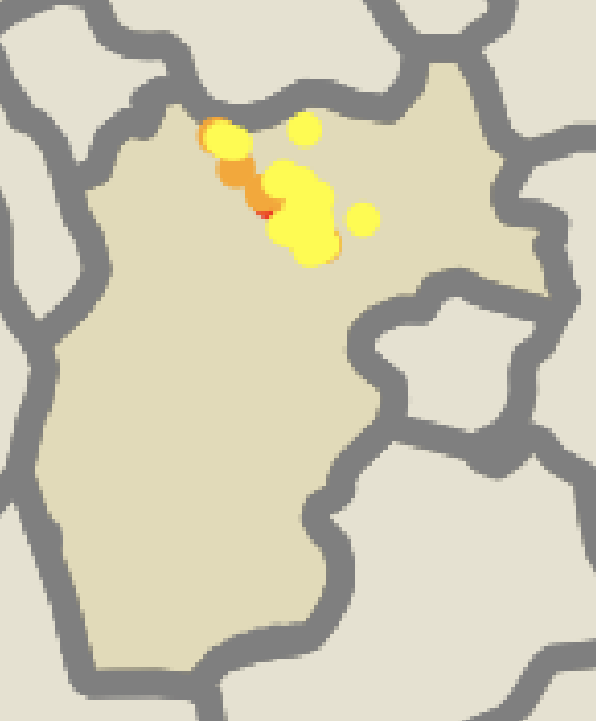

# Project 3 

The adm2 subdivision I chose for Project 3 was Quetzaltenango where the majority of the population resides in the urban segment. 

The plot shown above indicates that the majority of the population resides in the north of Quetzaltenango. There is only one urban region in this subdivision.

The city has a prominent public bus transport system and there is a volcano located south of the urban area which is why every road is located in the north. The road network is ample given the size of the roads and the network. 

Quetzaltenango has one major hospital and numerous pharmacies, for its 1800000 constituents. 
